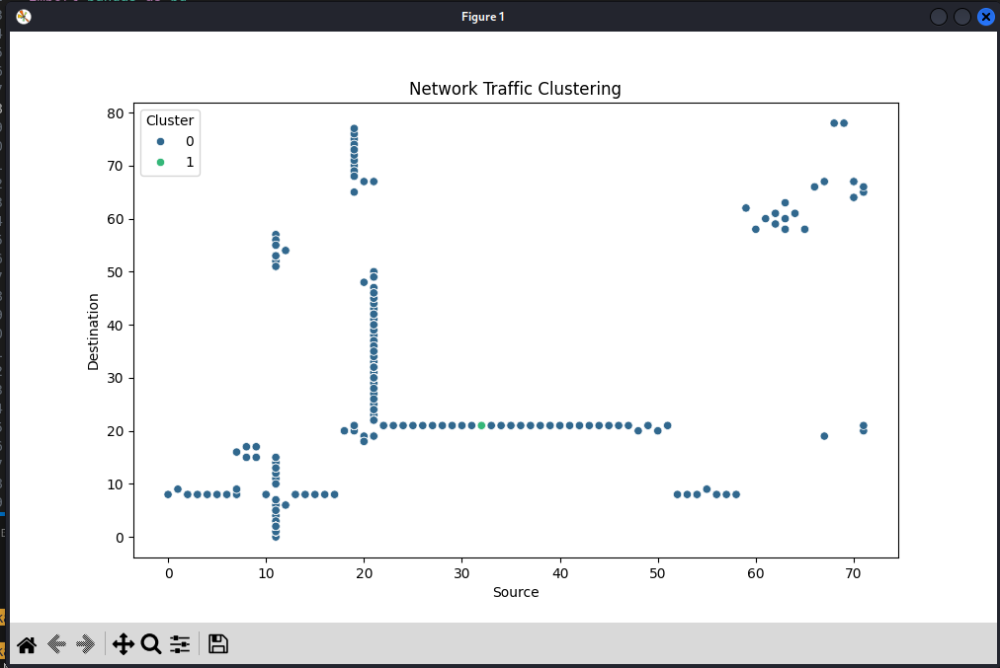
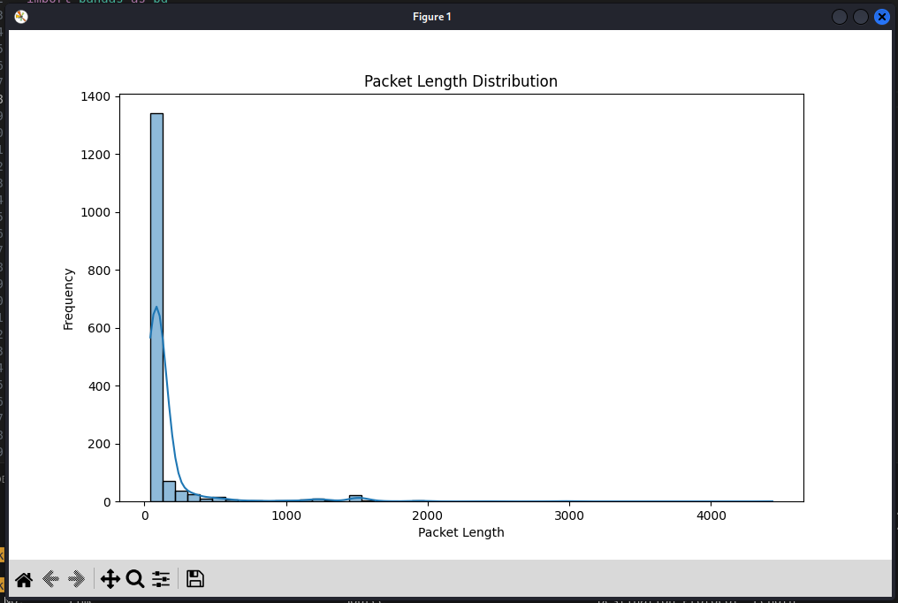
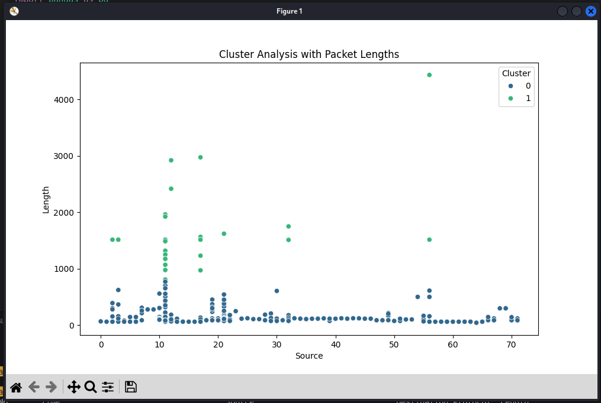

# LAB 04: Threat Hunting with AI Simulation

## Objective

In this lab, students will learn how to perform threat hunting using Artificial Intelligence (AI) in a Kali Linux virtual environment. They will deploy pre-trained AI models to analyze captured network traffic, distinguish between normal and attack patterns, and document their findings.

---

## Prerequisites

Students should have:

- Kali Linux Virtual Machine with internet access
- Familiarity with basic Linux terminal commands
- Basic understanding of Python and virtual environments

---

## Lab Setup

### Materials Needed

- Kali Linux virtual machine (username: `kali`, password: `kali`)
- Internet connection (initially)
- The provided [files](https://github.com/dngoins/CTI-Course):
  - `SimulateNetworkAttack.py`
  - `NormalNetworkTraffic.csv`
  - `AttackedNetworkTraffic.csv`
  - `AIThreatHunting.py`

### Duration

40–50 minutes total

---

## Instructions

### 🕐 Task 1: Kali Linux VM Setup (5 Minutes)

**Steps:**

1.1 Boot up the Kali Linux Virtual Machine.  
1.2 Login using credentials:  
- **Username:** kali  
- **Password:** kali  

---

### 📥 Task 2: Download & Deploy AI Models (10 Minutes)

**Objective:** Obtain and set up AI models required for threat analysis.

#### K-Means Clustering Model Setup

2.1 Open the terminal and update system packages:
```bash
sudo apt-get update
```

2.2 Ensure Python and Pip3 are installed:
```bash
sudo apt-get install python3-pip python3-tk
```

2.3 Clone the scikit-learn repository:
```bash
git clone https://github.com/scikit-learn/scikit-learn.git
```

  >**_Note:_** If this folder already exists, you can skip this step.

2.4 Navigate to the cloned directory:
```bash
cd scikit-learn
```

2.4.1 Get the latest from cloned directory:
```bash
git pull
```

2.5 Create a Python virtual environment:
```bash
python3 -m venv (your-Initials)-threat-hunt-env # replace (your-Initials) with your initials
```

  >**_Note:_** If you have already created a virtual environment, you can skip this step.


2.6 Activate the virtual environment:
```bash
source (your-Initials)-threat-hunt-env/bin/activate # replace (your-Initials) with your initials
```

2.7 Install scikit-learn and dependencies:
```bash
pip3 install -U scikit-learn pandas matplotlib seaborn notebook ipython
```

2.8 Return to the home directory:
```bash
cd ~
```

#### Gradient Boosting Model Setup

2.9 Confirm the virtual environment is activated; if not, activate it again:
```bash
source ~/scikit-learn/(your-Initials)-threat-hunt-env/bin/activate # replace (your-Initials) with your initials
```

2.10 Install XGBoost:
```bash
pip3 install xgboost
```

---

### 📡 Task 3: Network Traffic Capture (5 Minutes)

**Objective:** Capture baseline normal network traffic.

**Steps:**

3.1 Open a new terminal window and start Wireshark:
```bash
wireshark
```

3.2 Select the `eth0` LAN network interface.

3.3 Capture normal traffic for **2 minutes**. Try to capture about **1000 - 1500** packets of data. For AI we need data, the more the merrier, but this is a lab, and too much will make your vm run out of space.

3.4 While capturing normal baseline traffic, Open the browser and browse to your favorite news web site. Open your email browser and generate normal network traffic.

3.5 After about 2 minutes, export captured traffic as CSV:
- `FILE -> Export Packet Dissections -> As CSV`
- Select all packets.
- Save as `NormalNetworkTraffic.csv`.
-- **Keep The Network Traffic Capture running**

---

### 🚨 Task 4: Simulate Network Attack (10 Minutes)

**Objective:** Simulate a network attack scenario to generate anomalous traffic data.

**Steps:**

4.1 Obtain the provided `SimulateNetworkAttack.py` file from your instructor or the CTI-Labs folder and copy it into your home directory.

4.2 Identify the IP address:
```bash
ifconfig
```
- Note down `inet` from the `eth0` interface.

4.3 Edit `SimulateNetworkAttack.py`:
- Replace the placeholder `target_ip` with your identified IP address.

4.4 Run the simulation (for about 1 minute initially):
```bash
python SimulateNetworkAttack.py
```

4.5 While still running, capture traffic with Wireshark:
- Stop the **SimulateNetworkAttack** script with `CTRL+C`. 
- Then after a short time (5–10 seconds), start the script again to simulate a burst of attacks again.
- When running the Simulation, it's possible the VM performance will overload.
- Stop the script to allow Wireshark and VM performance to stabilize between bursts.
- Repeat bursts until you capture about 1000-1500 packets, or about 1-2 minutes of traffic. Try to match the number of packets captured during the normal baseline capture.

4.6 Save captured traffic as CSV:
- `FILE -> Export Packet Dissections -> As CSV`
- Save as `AttackedNetworkTraffic.csv`.

---

### 🧪 Task 5: Threat Hunting with AI Models (10 Minutes)

**Objective:** Utilize AI models to hunt for threats within network data.

**Steps:**

5.1 Activate your Python virtual environment:
```bash
source ~/scikit-learn/(your-Initials)-threat-hunt-env/bin/activate
```

5.2 Obtain `AIThreatHunting.py` from your instructor or look in Desktop CTI-Labs folder, and ensure it's placed in your home directory.

5.3 Open **AIThreatHunting** with Visua Studio Code
  - type ` code ./AIThreatHunting.py `

5.4 Verify the CSV file it will open is **NormalNetworkTraffic.csv** in first few lines of code

5.5 Execute AI threat hunting script:
```bash
python3 -i AIThreatHunting.py
```

5.6 Review the images and save them corresponding to the name of the diagram (i.e. Normal-Cluster Analysis..). Save the images to the CTI-Labs folder with **Normal-** as the prefix.

5.7 Change the CSV File to **AttackedNetworkTraffic.csv** in the AIThreatHunting.py source code and save it.

5.8 Execute AI threat hunting script:
```bash
python3 -i AIThreatHunting.py
```

5.9 Review the images and save them to the CTI-Labs folder with **Attack-** as the prefix

5.10 Analyze output images from the script, compare to detect anomalies. What did you discover? How would you interpret the findings? Did the 0 and 1 groupings flip? Why?



This image shows the clustering of network traffic based on IP destination and source. The clusters represent different types of traffic, with the green cluster indicating potential positive attack traffic.





5.5 Modify the AIThreatHunting.py script:

**Include additional features:** 
- Change the number of clusters in KMeans machine learning algorithm (line 22)
- Add in other fields from the packet capture, as new fields may have other data correlations
- Aggregate the normaltraffic and attacktraffic into one dataset.
  - Train a model to predict and detect normal versus an anomaly.
    - Use a Logistic regression algorithm to determine if traffic is normal or anomalous based on the AggregateNetworkTraffic.csv file.
    - Use a Random Forest algorithm to determine if traffic is normal or anomalous based on the AggregateNetworkTraffic.csv file.
    - Use a Gradient Boosting algorithm to determine if traffic is normal or anomalous based on the AggregateNetworkTraffic.csv file.
  - Determine which of the above models yeilds the best prediction.

**Additional Visualization Ideas:**
- Create ROC curves for each classification model to compare their performance and identify the optimal threshold
- Generate confusion matrices as heatmaps to visualize prediction accuracy and false positive/negative rates
- Plot feature importance scores to show which network characteristics contribute most to anomaly detection
- Develop correlation heatmaps to identify relationships between different network traffic features
- Create time-series plots showing traffic patterns over time to identify temporal anomalies

---

### 📊 Task 6: Analysis & Reporting (10 Minutes)

**Objective:** Interpret AI model outputs to identify and document threats.

**Steps:**

6.1 Document your findings clearly, identifying potential threats.

6.2 Classify threats based on identified patterns:
- Normal vs. Attack clusters.

6.3 Create visualizations (if applicable) to represent anomalies detected.

6.4 Report should include:
- Cluster Analysis Summary
- SYN Flood Attack characteristics
- Packet Length Distribution Visualization

---

## Reasoning & Visualization Techniques

### Cluster Analysis:
- Identify normal vs. anomalous traffic patterns.
- Use AI clustering to distinguish benign from malicious activities.

### SYN Flood Attack Identification:
- Analyze packets for repetitive SYN requests.
- Detect potential SYN flood attacks through packet frequency and sources.

### Packet Length Visualization:
- Use graphical plots to visualize packet length distributions.
- Identify deviations indicative of attack traffic.

---

## Key Takeaways

- Threat hunting can be greatly enhanced with AI and ML techniques.
- Capturing and analyzing network traffic provides actionable threat intelligence.
- AI clustering methods efficiently segregate normal from malicious traffic.
- Visualization assists in rapid detection and understanding of anomalies.

---

## References

- [Malware-Traffic-Analysis.net - Training Exercises](https://www.malware-traffic-analysis.net)
- [Detecting Network Attacks with Wireshark - InfosecMatter](https://www.infosecmatter.com/detecting-network-attacks-wireshark)

--- 

